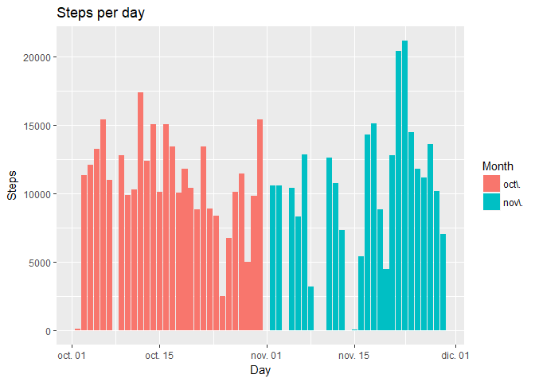
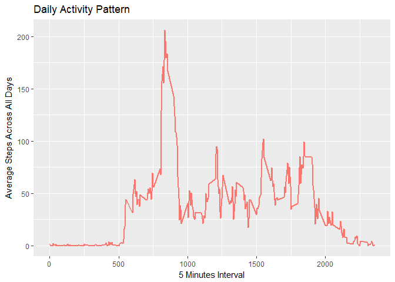
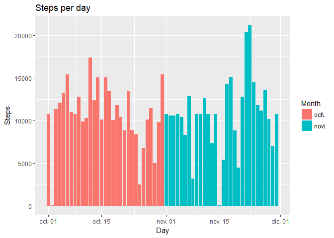
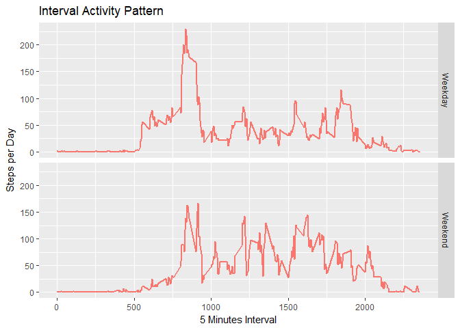

##Loading and Preprocessing the data


```r
url <- "https://d396qusza40orc.cloudfront.net/repdata%2Fdata%2Factivity.zip"
download.file(url, destfile = "activityD.zip")
unzip(zipfile = "activityD.zip")
activityData <- read.csv(file = "activity.csv", header = TRUE, sep = ",")
```


##What is mean total number of steps taken per day?


```r
sumData <- activityData %>%
      filter(complete.cases(steps)) %>%
      group_by(date) %>%
      summarise(sumPerDay = sum(steps))

statData <- sumData %>%
      ungroup(sumData) %>%
      summarise(meanSteps = mean(sumPerDay), 
                medianSteps = median(sumPerDay))

sumData %>% ggplot(aes(x = ymd(date), y = sumPerDay, fill = month(ymd(date), 
      label = TRUE))) + geom_histogram(binwidth = 5, stat = "identity") +
      labs(title = "Steps per day", x = "Day", y = "Steps") + 
      scale_fill_discrete(name = "Month")
```

```
## Warning: Ignoring unknown parameters: binwidth, bins, pad
```

<!-- -->


* Mean total number of steps taken per day: 1.0766189\times 10^{4}
 
* Median total number of steps taken per day: 10765


##What is the average daily activity pattern?


```r
compData <- activityData %>%
      filter(complete.cases(steps)) %>%
      group_by(interval) %>%
      summarise(avg = mean(steps))

maxInterval <- compData %>%
      filter(avg == max(avg))
      
compData %>% ggplot(aes(x = interval, y = avg, color = "red")) +
      geom_line(stat = "identity", size = 1) +
      labs(title = "Daily Activity Pattern", x = "5 Minutes Interval", y = "Average Steps Across All Days") +
      guides(color = "none")
```

<!-- -->

Which 5-minute interval, on average across all the days in the dataset, contains the maximum number of steps?

5 Minute Interval: 835

Max Average Steps Across All Days: 206.1698113


##Imputing missing values


```r
naData <- activityData %>%
      filter(!complete.cases(steps))

sumNa <- nrow(naData)

for(i in 1:length(naData$steps)){
      naData$steps[i] <- compData$avg[compData$interval == naData$interval[i]]
}

filledData <- activityData

for(i in 1:length(filledData$steps)){
      if(is.na(filledData$steps[i])){
            filledData$steps[i] <- naData$steps[filledData$interval[i] ==
            naData$interval & filledData$date[i] == naData$date]
      }
}

sumFilledData <- filledData %>%
      group_by(date) %>%
      summarise(sumPerDay = sum(steps))

statFilledData <- sumFilledData %>%
      ungroup(filledData) %>%
      summarise(meanSteps = mean(sumPerDay), 
                medianSteps = median(sumPerDay))

sumFilledData %>% ggplot(aes(x = ymd(date), y = sumPerDay, fill = month(ymd(date), 
      label = TRUE))) + geom_histogram(binwidth = 5, stat = "identity") +
      labs(title = "Steps per day", x = "Day", y = "Steps") + 
      scale_fill_discrete(name = "Month")
```

```
## Warning: Ignoring unknown parameters: binwidth, bins, pad
```

<!-- -->

- Total number of missing values: 2304
- Mean total number of steps taken per day without NA Values: 1.0766189\times 10^{4}
- Median total number of steps taken per day without NA Values: 10765
- Mean total number of steps taken per day with NA filled: 1.0766189\times 10^{4}
- Median total number of steps taken per day with NA filled: 1.0766189\times 10^{4}


_These values are not different as NA Values were filled with average interval values across all days. This has a low impact on values and don't change data quality._


##Are there differences in activity patterns between weekdays and weekends?


```r
weekFilledData <- filledData %>%
      mutate(week = factor(isWeekday(as.Date(date, 
      format = "%Y-%m-%d")), levels = c(TRUE, FALSE), 
      labels = c("Weekday", "Weekend"))) %>%
      group_by(week, interval) %>%
      summarise(avgSteps = mean(steps))

weekFilledData %>% ggplot(aes(x = interval, y = avgSteps, 
                             color = "red")) +
      geom_line(stat = "identity", size = 1) +
      labs(title = "Interval Activity Pattern", x = "5 Minutes Interval", y = "Steps per Day") +
      guides(color = "none") +
      facet_grid(week ~ .)
```

<!-- -->


On weekdays, there is more steps registered form 0 to 1000 intervals, while one weekends has more steps registered after interval 1000.
